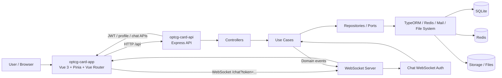

# OPTCG 資料流與架構圖

這份文件整理 `optcg-card-app`（前端）與 `optcg-card-api`（後端）之間的主要資料流。

## 前端

- `ChatView.vue` 只負責頁面編排。
- `useChatRoomSession` 負責登入狀態、房間切換、WebSocket 連線與初始化。
- `useChatMessages` 負責訊息載入、分頁、捲動與時間標籤。
- `useChatRoomModals` 負責聊天室相關 modal 與操作流程。
- `chatStore` 作為聊天室共享狀態中心。

## 後端

- Controller 接收 HTTP / WebSocket 請求。
- Use Case 負責商業邏輯與驗證。
- Repository / Adapter 連接 TypeORM、Redis、檔案系統與其他基礎設施。
- 錯誤碼集中在 `ERROR_CODES` 與 HTTP 對照表，避免散落字串錯誤。

## 主要流程

1. 使用者登入後，前端透過 HTTP 取得房間、訊息、個人資料等資料。
2. WebSocket 負責即時事件，例如新訊息、成員變動、邀請狀態更新。
3. 前端將事件同步到 Pinia store，再由畫面元件重新渲染。
4. 後端的 Use Case 與 Repository 保持資料一致性，並把狀態寫回 SQLite / Redis / 檔案系統。

## 補充

- API 透過 `VITE_API_BASE_URL` 串接。
- JWT Access Token 透過 `Authorization` header 傳遞。
- Refresh Token 保存在 HttpOnly cookie。
- 聊天即時更新與權限狀態以 WebSocket 為主。
